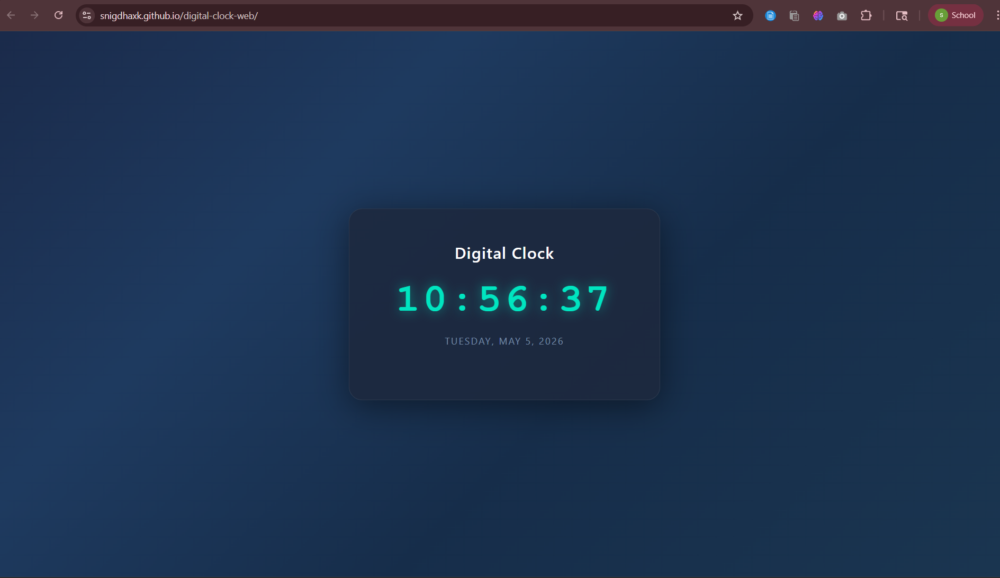

# 🕐 Digital Clock



> A sleek, real-time digital clock that displays live time and date — built with a clean dark UI and smooth teal typography.

[](https://snigdhaxk.github.io/digital-clock-web/)
[]()
[]()

---

## 🔗 Live Demo

🌐 [https://snigdhaxk.github.io/digital-clock-web/](https://snigdhaxk.github.io/digital-clock-web/)

---

## ✨ Features

- 🕐 **Live Time Display** — Hours, minutes & seconds updated every second in real time
- 📅 **Live Date Display** — Shows current day, month and year
- 🌑 **Dark Theme UI** — Deep blue gradient background with glowing teal clock digits
- 📱 **Responsive Design** — Centered layout that works on all screen sizes
- ⚡ **Zero Dependencies** — Pure HTML, CSS & JavaScript, no libraries needed

---

## 🛠️ Tech Stack

| Technology | Usage |
|---|---|
| HTML5 | Structure & markup |
| CSS3 | Dark theme, gradient background, typography |
| JavaScript (Vanilla) | Real-time clock logic using `setInterval` & `Date` API |
| GitHub Pages | Deployment & hosting |

---

## 📁 Project Structure

```
digital-clock-web/
├── index.html       # Main HTML file
├── style.css        # Clock styling & dark theme
├── script.js        # Clock logic (time & date update)
└── README.md        # Project documentation
```

---

## 🧠 What I Learned

- Using JavaScript's built-in `Date` object to get live time
- Running recurring logic with `setInterval()`
- Formatting time values with leading zeros (e.g. `09` instead of `9`)
- Building visually polished UIs with pure CSS — gradients, shadows & typography

---

## 👩‍💻 Author

**M. Snigdha Kundana**
3rd Year CSE Student

[](https://github.com/snigdhaxk)
[](https://www.linkedin.com/in/snigdha-kundana-molugu-b6b250302)

---

> ⭐ If you liked this project, drop a star — it means a lot!
